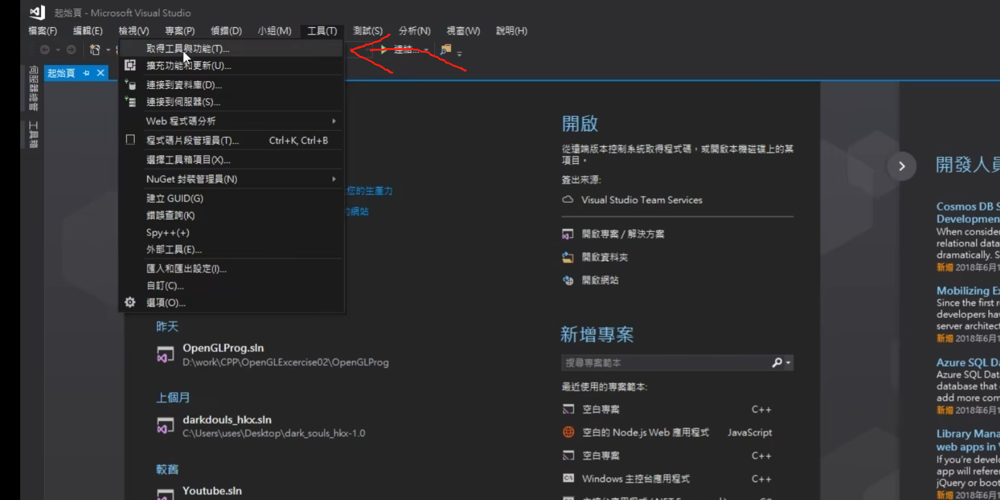
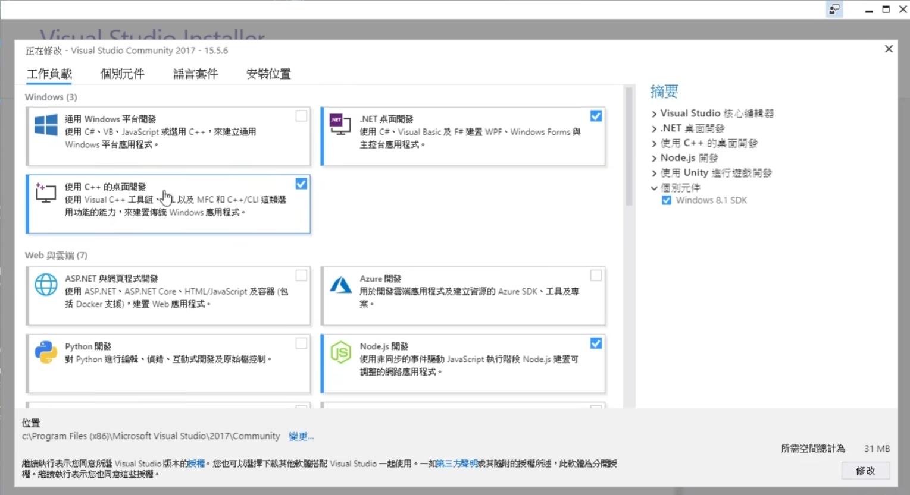
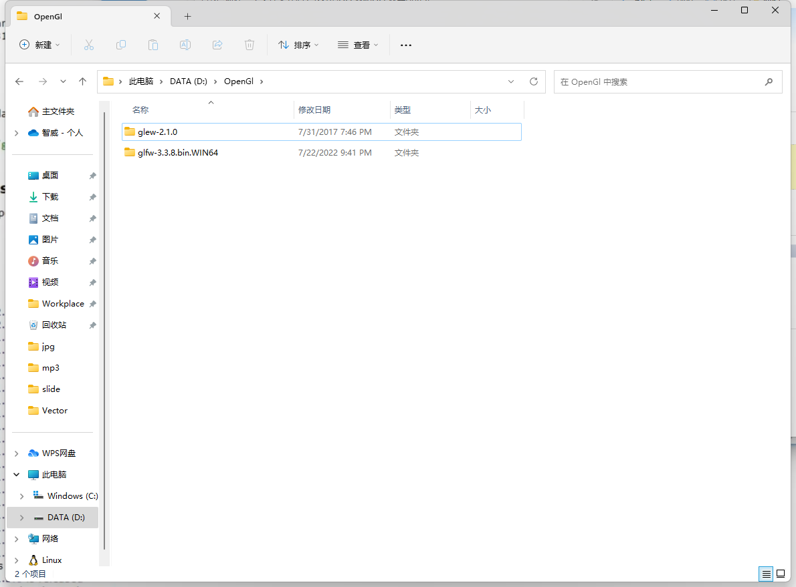
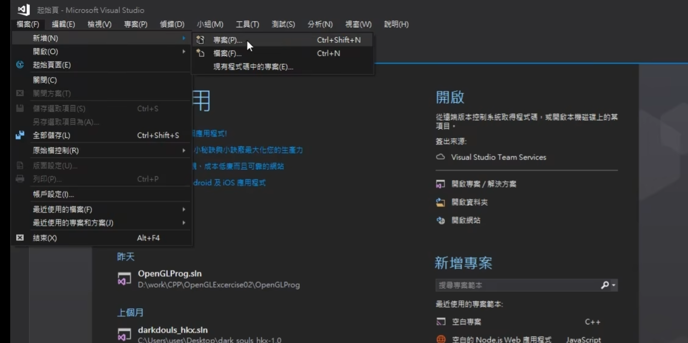
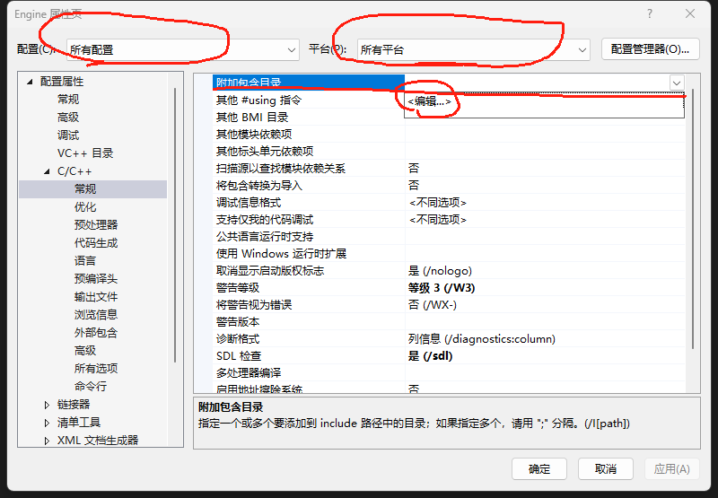
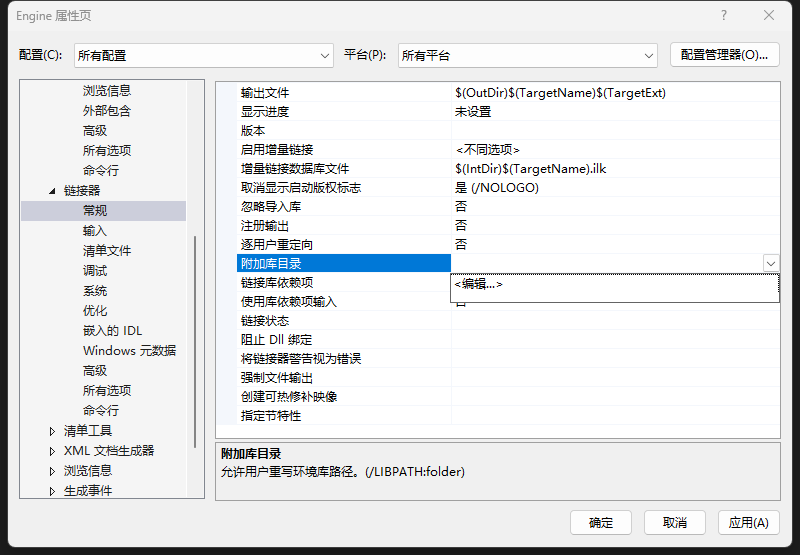
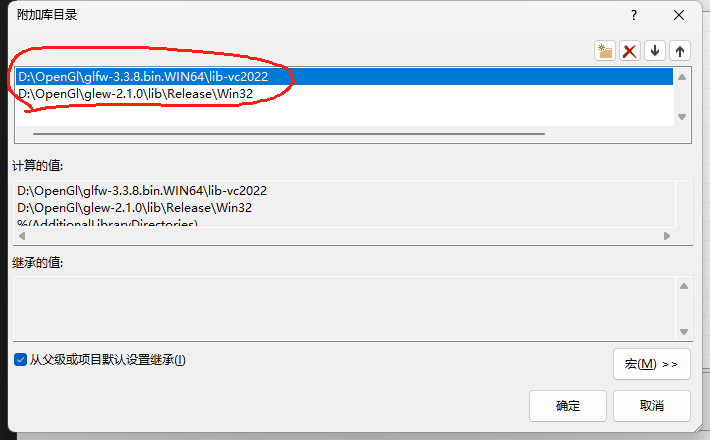
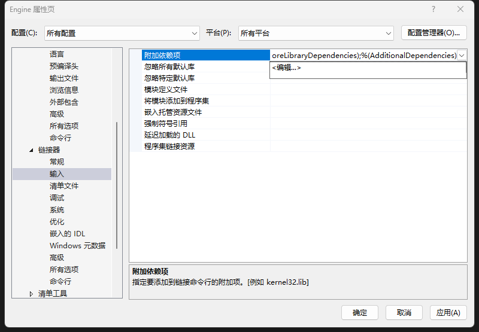
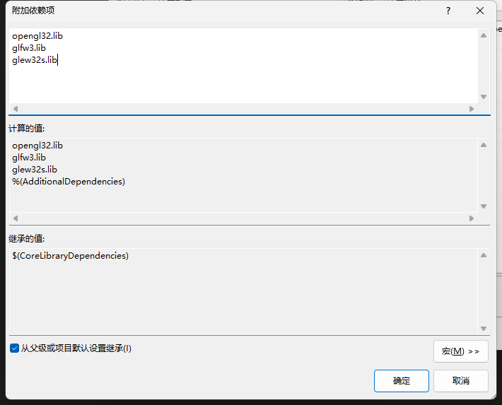

# RealTimeRendering

Real-time rendering engine based on C++ and OpenGL

[OpenGL docs](https://learnopengl.com)

[中文文档](https://learnopengl-cn.github.io/intro/)

[glfw docs](https://www.glfw.org/docs/latest/index.html)

## Preparations(准备工作)

#### Install vistual Studio Cpp components

#### Install GLFW

- download GLFW(https://github.com/glfw/glfw/releases/download/3.3.8/glfw-3.3.8.bin.WIN32.zip)

#### install GLEW

- download GLEW(https://sourceforge.net/projects/glew/files/glew/2.1.0/glew-2.1.0-win32.zip/download)

Create a new folder and extract the downloaded GLEW and GLFW into it

Create a new project

#### Setup include

- Include GLFW and GLEW
  

- Link GLFW and GLEW
  

  Pay attention to choosing the right path
  

  

  
